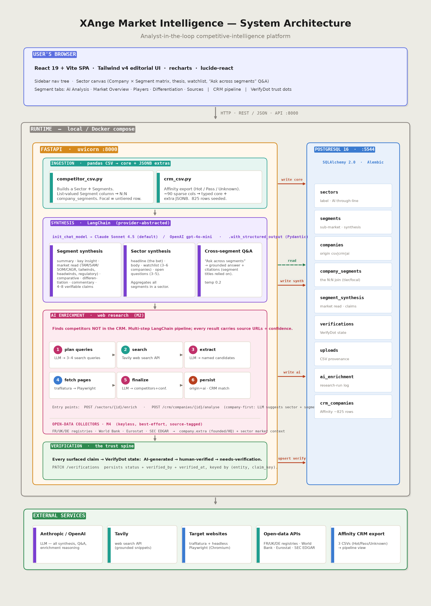
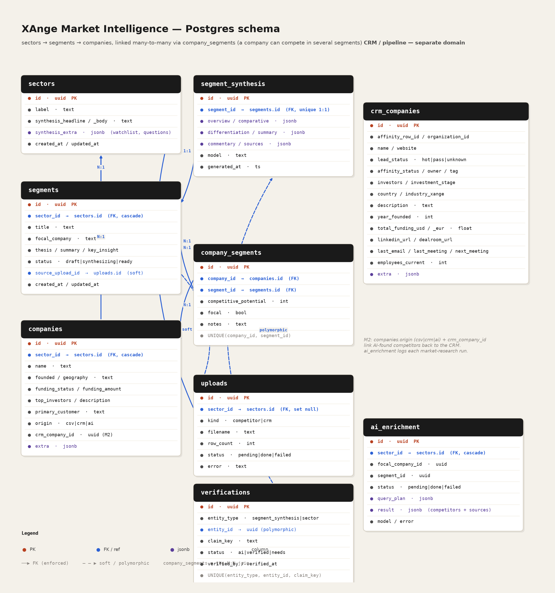

# XAnge Market Intelligence Platform

An internal market-intelligence tool for XAnge's VC investment team — map
competitive landscapes, track players, and synthesise market signals in one
place.

**Thesis:** AI produces a first-pass competitive scaffold (player tables,
positioning, market reads, sector synthesis). Analysts then **interrogate,
correct, and verify** it — every AI-surfaced claim carries a verification state
(the `VerifyDot` trust model). It augments analyst judgment; it doesn't replace it.

> ESADE MiBA Capstone, built as a real tool for XAnge (a French/European VC).
> See `CLAUDE.md` for the project source-of-truth.

```
frontend/   React 19 + Vite + Tailwind v4  — the UI (served by nginx in prod)
backend/    FastAPI + PostgreSQL + LangChain — API, ingestion, synthesis, collectors
```

---

## Architecture

A React SPA talks to a FastAPI backend over REST; the backend owns ingestion,
LangChain synthesis, AI enrichment (web research), the open-data collectors, and
the verification trust state, all persisted to PostgreSQL. The whole thing runs
locally or as a Docker Compose stack.



---

## Data model

`Sector → Segment → Company`, with companies linked **many-to-many** to segments
via `company_segments` (a company can compete in several segments; per-segment
tier/focal/notes live on the join). Each segment has a 1:1 `segment_synthesis`;
the CRM **pipeline** (`crm_companies`) is a separate domain. Every table carries
typed core columns plus a JSONB `extra` for unmapped CSV columns.



---

## Getting data in — the two CSV entry points

Everything starts from a CSV. There are **two independent ingestion paths**:

### 1. Competitor-analysis CSV → creates (or extends) a **Sector**

A manually-curated competitor spreadsheet becomes a whole competitive landscape:

- **Segments** are derived from the CSV's list-valued **`Segment`** column (one
  company can list several → it's linked to each).
- **Companies** become sector-scoped rows; **`Competitive Potential`** (tier
  1/2/3) sets priority, and an untiered focal row marks the "company search path".
- Known columns map to typed fields; **unmapped columns are kept in JSONB
  `extra`** (the "fixed core + flexible extras" rule), so different analyses with
  different columns all ingest cleanly.

Upload it in the UI (**Create sector → drop CSV**), or via the API:

```bash
curl -X POST http://localhost:8000/api/uploads/competitor \
  -F "file=@backend/scripts/demo_competitor.csv" \
  -F "sector_label=AI in Financial Services"
```

Re-uploading with the same `sector_label` **extends** that sector (adds new
segments/companies). One competitor CSV = one sector.

### 2. CRM export CSV(s) → updates the **Deal Pipeline**

XAnge's Affinity export (the Hot / Pass / Unknown lead lists) feeds the
cross-cutting pipeline view — **separate** from the competitor data in v1.

- Upload **one or more** CSVs at once; they're concatenated.
- `lead_status` (hot / pass / unknown) is inferred from each file's name.
- ~90 sparse Affinity columns → typed core + JSONB `extra`.

```bash
curl -X POST http://localhost:8000/api/uploads/crm \
  -F "files=@'Hot Leads ... export.csv'" \
  -F "files=@'Pass Leads ... export.csv'" \
  -F "files=@'Unknown Leads ... export.csv'"
```

Re-uploading **adds to / refreshes** the pipeline. (The bundled `scripts.seed`
does exactly this for the three sample exports.)

### What happens after ingestion

| Step | What it does |
|------|--------------|
| **AI synthesis** | sector through-line + per-segment market read (TAM/SAM/SOM, CAGR, tailwinds/headwinds, regulatory), differentiation, and cross-segment Q&A — LangChain, structured output, with verifiable claims |
| **AI enrichment** | finds competitors *not in the CRM*: LLM plans queries → Tavily search → trafilatura/Playwright fetch → structured competitor list with source URLs + confidence |
| **Open-data collectors** | backfill founding year, HQ, and macro market context from free public registries/APIs — each value source-tagged |
| **Verification** | every surfaced claim gets a `VerifyDot` state (AI-generated → human-verified → needs-verification), persisted |

---

## Quick start — Docker (full package)

The fastest way to run the whole stack (Postgres + API + UI).

**Prerequisites:** Docker (with Compose v2).

```bash
cp .env.example .env        # optional: add LLM / Tavily / Companies House keys
docker compose up --build -d
```

Open **http://localhost:8080**. The API is also at http://localhost:8000
(docs at http://localhost:8000/docs). DB migrations run automatically on startup.

Every key in `.env` is **optional** — the app boots and serves with all of them
blank; the AI/research/collector features stay dormant until a key is present.

**Seed real data (optional).** The app starts empty; to load the CRM export +
demo competitor sector, mount the CSV folder and run the seed once:

```bash
docker compose run --rm -v /abs/path/to/crm/data:/data backend \
  uv run python -m scripts.seed
```

Tear down with `docker compose down` (add `-v` to also drop the database volume).

---

## Local development

**Prerequisites:** Docker (for Postgres), [`uv`](https://docs.astral.sh/uv/), Node 20+.

### Backend (Postgres + API)

```bash
cd backend
cp .env.example .env                 # defaults work out of the box
docker compose up -d                 # Postgres on localhost:5544
uv sync                              # install Python deps (Python 3.12)
uv run playwright install chromium   # once — for the web-research fallback
uv run alembic upgrade head          # create tables
uv run python -m scripts.seed        # load CRM CSVs (+ demo sector if present)
uv run uvicorn app.main:app --reload --port 8000
```

API at http://localhost:8000 · docs at http://localhost:8000/docs.

### Frontend

```bash
cd frontend
npm install
npm run dev        # http://localhost:5173 (proxies /api → :8000)
```

---

## Configuration

All backend settings come from `backend/.env` (local) or compose env (Docker).
See `backend/app/config.py`.

| Variable | Purpose | Required? |
|----------|---------|-----------|
| `DATABASE_URL` | Postgres connection | yes (defaulted) |
| `CORS_ORIGINS` | allowed frontend origins | yes (defaulted) |
| `LLM_PROVIDER` | `anthropic` \| `openai` | for AI features |
| `ANTHROPIC_API_KEY` / `OPENAI_API_KEY` | LLM key (matching the provider) | for AI features |
| `LLM_MODEL` | optional model override | no |
| `TAVILY_API_KEY` | web search for AI enrichment | for enrichment |
| `COMPANIES_HOUSE_API_KEY` | UK registry collector (free key) | for UK lookups |
| `CRM_DATA_DIR` | path to the CRM CSV folder | for seeding |

---

## Data & information sources

The platform turns the two analyst CSVs (above) into a verified landscape, then
augments them with AI research and free open-data collectors. **Every
AI-surfaced or collected value carries its source** so the analyst can verify it.

### AI layer (LangChain, provider-agnostic)

- **Anthropic / OpenAI** — sector & segment synthesis, market read, commentary,
  differentiation, cross-segment Q&A, and the reasoning behind AI enrichment.

### Web research (AI competitor discovery)

- **Tavily** — LLM-grounded web search.
- **trafilatura → Playwright (Chromium)** — page fetch (fast static first, headless
  browser fallback), incl. **company homepages**.

### Open-data collectors

Each value is fetched best-effort (failures degrade gracefully) and source-tagged.
**Live** = an automated collector ships with the app.

| Source | What it provides | Live? | Key |
|--------|------------------|-------|-----|
| **Annuaire des Entreprises** (data.gouv.fr) | FR founding year + HQ | ✅ | keyless |
| **UK Companies House** | UK incorporation date + office | ✅ | free key |
| **Unternehmensregister (DE)** | DE founding year + HQ + register id | ✅ | keyless* |
| **World Bank Open Data** | population / GDP (global) | ✅ | keyless |
| **Eurostat** | population / GDP (EU-authoritative) | ✅ | keyless |
| **SEC EDGAR** (full-text search) | filing-mention count (traction signal) | ✅ | keyless† |
| **Company homepage** | profile free-text | ✅ | via research agent |
| EUR-Lex · Sifted/EU-Startups · Dealroom · LinkedIn | regulatory / news / profiles | reference only | — |

\* The official German portal (unternehmensregister.de) is JSF/anti-bot, so the
DE collector scrapes **OffeneRegister** (a Handelsregister open-data mirror) with
a **Wikidata** fallback for founding year + HQ.
† SEC EDGAR is keyless but requires a descriptive `User-Agent` (`COLLECT_USER_AGENT`).

The live catalogue is served at `GET /api/sources`.

---

## Key endpoints

| Method | Path | Purpose |
|--------|------|---------|
| GET | `/api/health` | liveness |
| GET | `/api/sectors` · `/api/sectors/{id}` | sector tree / detail |
| PATCH / DELETE | `/api/sectors/{id}` | edit / delete a sector |
| POST | `/api/sectors/{id}/synthesize` | AI sector synthesis |
| POST | `/api/sectors/{id}/ask` | cross-segment Q&A |
| POST | `/api/sectors/{id}/enrich` | AI competitor discovery |
| POST | `/api/sectors/{id}/market-context` | World Bank + Eurostat macro pull |
| GET / PATCH | `/api/segments/{id}` | segment detail / edit |
| POST | `/api/segments/{id}/synthesize` | AI segment synthesis |
| GET | `/api/crm/companies?status=hot&q=...` | CRM pipeline (filtered, paginated) |
| POST | `/api/crm/companies/{id}/analyse` | company-first AI analysis |
| PATCH | `/api/companies/{id}` | edit a company's core facts |
| POST | `/api/companies/{id}/collect-registry` | registry lookup (FR/UK/DE) |
| POST | `/api/companies/{id}/collect-edgar` | SEC EDGAR mention count |
| POST | `/api/uploads/competitor` | competitor CSV → sector |
| POST | `/api/uploads/crm` | CRM CSV(s) → pipeline |
| PATCH | `/api/verifications` | persist a claim's verification state |
| GET | `/api/sources` | the open-data source catalogue |

Full interactive reference at `/docs`.

---

## Tests

```bash
cd backend && uv run pytest        # 49 tests; external calls are mocked
```

## Regenerating the diagrams

`architecture.png` and `data_schema.png` are generated from code:

```bash
cd backend && uv run python scripts/make_architecture_png.py
              uv run python scripts/make_schema_png.py
```

---

## Demo walkthrough (≈3 min)

1. **Home** — create a sector (CSV upload), browse the pipeline, or open a sector.
2. **Upload** a competitor CSV → lands in a new **Sector** with derived segments.
3. **Synthesise** (top-right) → the **AI Analysis** tab fills with summary, key
   insight, narrative and verifiable **claims** — click the dots to mark each
   verified / needs-verification (persists).
   - **Market Overview**: AI TAM/SAM/SOM, CAGR, tailwinds/headwinds, regulatory.
   - **Players / Differentiation**: built from the uploaded companies.
   - **Sources**: the claims as a verifiable evidence register.
4. **Find competitors** → AI discovers non-CRM players with source provenance.
5. **Ask across segments** → grounded Q&A with citations; **Save** analyst edits.
6. **Deal Pipeline** → browse the CRM companies; filter by status, country, search.
